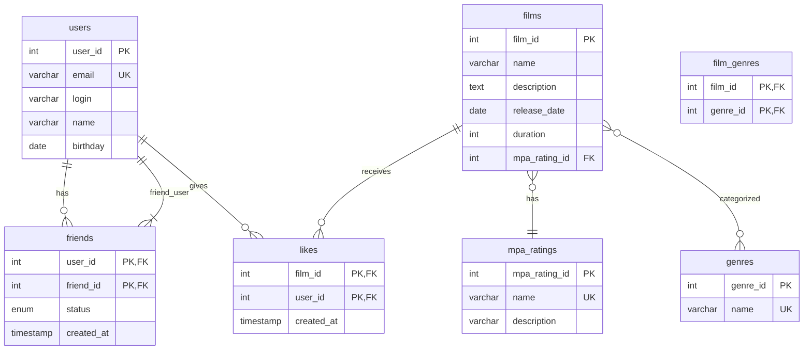

## java-filmorate
Template repository for Filmorate project.
Filmorate Database Schema
Описание базы данных
База данных Filmorate предназначена для хранения информации о фильмах, пользователях, их предпочтениях и дружеских связях.

Схема базы данных

https://github.com/dimout00/java-filmorate/blob/678371a1ec5a176df603d9a3bcf22c6aa7fec594/filmorate_database_schema.png




Основные таблицы
users — содержит данные о пользователях.

films — содержит данные о фильмах.

mpa_ratings — справочник рейтингов MPA.

genres — справочник жанров.

film_genres — связь между фильмами и жанрами (многие ко многим).

friendships — дружеские связи между пользователями.

likes — лайки фильмов от пользователей.

Примеры запросов
Получить все фильмы

```sql
SELECT * FROM films;
```
#Получить топ N популярных фильмов

```sql
SELECT f.*, COUNT(l.user_id) AS likes_count
FROM films f
LEFT JOIN likes l ON f.film_id = l.film_id
GROUP BY f.film_id
ORDER BY likes_count DESC
LIMIT ?;
```
#Получить список друзей пользователя

```sql
SELECT u.* 
FROM friendships f
JOIN users u ON f.friend_id = u.user_id
WHERE f.user_id = ? AND f.status = 'confirmed';
```
#Получить общих друзей двух пользователей

```sql
WITH friends1 AS (
    SELECT friend_id AS user_id 
    FROM friendships 
    WHERE user_id = ? AND status = 'confirmed'
),
friends2 AS (
    SELECT friend_id AS user_id 
    FROM friendships 
    WHERE user_id = ? AND status = 'confirmed'
)
SELECT u.* 
FROM friends1 f1
JOIN friends2 f2 ON f1.user_id = f2.user_id
JOIN users u ON f1.user_id = u.user_id;
```
#Добавление нового пользователя

```sql
INSERT INTO users (email, login, name, birthday) VALUES (?, ?, ?, ?);
```
#Обновление данных пользователя

```sql
UPDATE users SET email=?, login=?, name=?, birthday=? WHERE user_id=?;
```

#Добавление лайка фильму

```sql
INSERT INTO likes (film_id, user_id) VALUES (?, ?);
```

#Удаление лайка


```sql
DELETE FROM likes WHERE film_id=? AND user_id=?;
```

#Добавление друга (отправка заявки)
```sql
INSERT INTO friendships (user_id, friend_id, status) VALUES (?, ?, 'unconfirmed');
```
#Подтверждение дружбы


```sql
-- Удаляем заявку
DELETE FROM friendships WHERE user_id=? AND friend_id=? AND status='unconfirmed';
-- Добавляем две подтвержденные записи
INSERT INTO friendships (user_id, friend_id, status) VALUES (?, ?, 'confirmed');
INSERT INTO friendships (user_id, friend_id, status) VALUES (?, ?, 'confirmed');
```
#Удаление друга

```sql
DELETE FROM friendships 
WHERE (user_id=? AND friend_id=? AND status='confirmed') 
   OR (user_id=? AND friend_id=? AND status='confirmed');
   ```
#Получить жанры фильма


```sql
SELECT g.* 
FROM film_genres fg
JOIN genres g ON fg.genre_id = g.genre_id
WHERE fg.film_id = ?;
```
#Получить рейтинг MPA фильма

```sql
SELECT m.* 
FROM mpa_ratings m
JOIN films f ON f.mpa_rating_id = m.mpa_rating_id
WHERE f.film_id = ?;
```
Примечания
В таблице friendships для подтвержденной дружбы хранятся две записи, чтобы упростить запросы на получение друзей пользователя.

Неподтвержденные заявки в друзья хранятся с статусом 'unconfirmed' и только в одном направлении (от инициатора к получателю).

Эта схема позволяет эффективно выполнять основные операции приложения Filmorate и обеспечивает целостность данных.